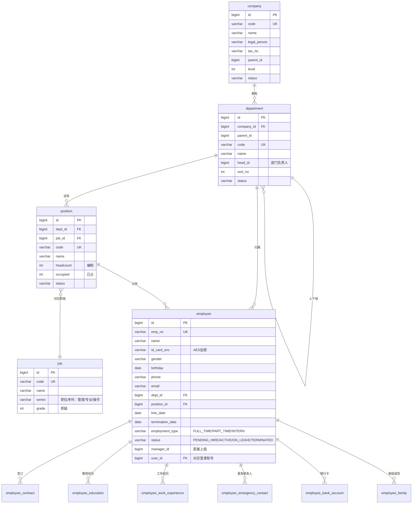
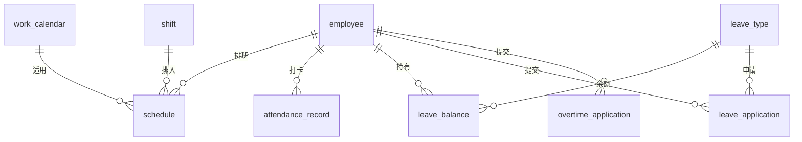
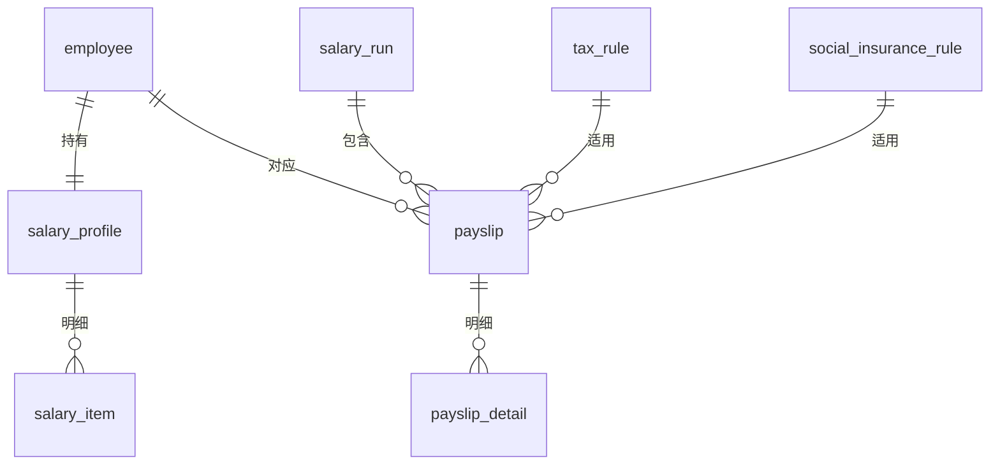
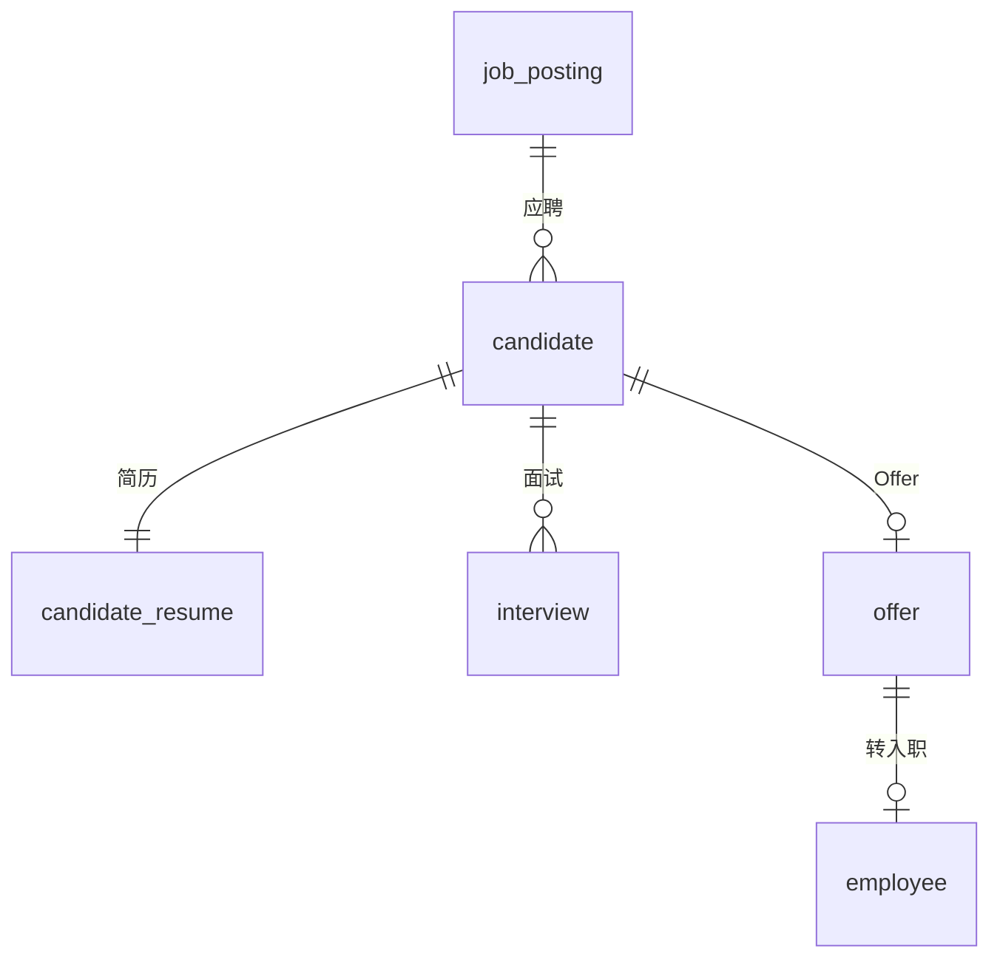
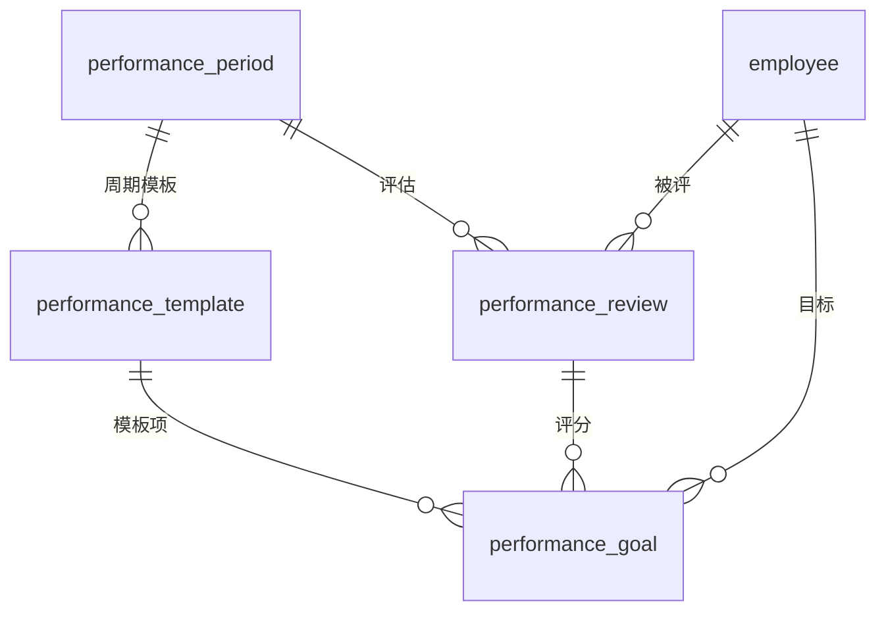

# HRMS 数据模型 v0.1

> 文档归属：技术架构师（architect）
> 适用范围：HRMS MVP 演示原型
> 版本：v0.1 · 2026-06-14
> 配套文档：`docs/architecture.md`、`.bmad/decisions.md`

本文件定义 HRMS 六大 Epic 的核心域实体、关键字段、状态机、索引策略与方言中性约定。所有 DDL 由 `db/changelog/` 下的 Liquibase changeSet 落地，本文件是规格说明、不是 SQL 实现。

---

## 1. 设计原则

### 1.1 通用字段（BaseEntity）

每张业务表必含 8 个通用字段（顺序固定，便于审计与 ORM 自动填充）：

| 字段 | 类型 | 含义 | 由谁写入 |
|---|---|---|---|
| `id` | `bigint` PK | 雪花算法 ID | MyBatis-Plus IdType.ASSIGN_ID |
| `created_at` | `timestamp` | 创建时间 | MyBatis-Plus 自动填充（INSERT） |
| `updated_at` | `timestamp` | 最后更新时间 | MyBatis-Plus 自动填充（INSERT/UPDATE） |
| `created_by` | `bigint` | 创建人 user_id | MyBatis-Plus 自动填充（INSERT） |
| `updated_by` | `bigint` | 最后更新人 user_id | MyBatis-Plus 自动填充（INSERT/UPDATE） |
| `deleted` | `tinyint`（0/1） | 软删除 | 由 `@TableLogic` 控制 |
| `version` | `int` | 乐观锁版本号 | `@Version` 自动 +1 |
| `tenant_id` | `bigint`（默认 1） | 租户隔离（MVP 单租户固定 1） | 自动填充 |

> `tenant_id` 现在不参与查询条件，但全表预留，避免后期加字段的 schema 变更。

### 1.2 命名约定

- 表名：`snake_case`，单数名（`employee`，不是 `employees`）；横切表前缀 `sys_`（如 `sys_user`）；流程表前缀 `approval_`。
- 字段名：`snake_case`，状态字段统一 `status`（不用 `state`/`flag`），编号字段统一 `*_no`。
- 外键字段：`<refTable>_id`，不带 `fk_` 前缀；`employee.dept_id` 而非 `employee.fk_dept_id`。
- 唯一索引：`uk_<table>_<col>`；普通索引：`idx_<table>_<cols>`；外键约束：`fk_<table>_<refTable>`。
- 状态枚举值：大写下划线（`PENDING_HIRE` / `ACTIVE`）。

### 1.3 类型约束（方言中性，见架构 6.4 节）

- 主键 / 外键统一 `bigint`。
- 短文本 `varchar(n)`（n ≤ 4000）。
- 长文本 / JSON / 富文本 `clob`，由应用层 Jackson 序列化。
- 金额 `decimal(18,4)`。
- 日期 `date`，时间戳 `timestamp`，禁用带时区类型。
- 布尔 `tinyint(1)` 或 `boolean`（由 Liquibase 抽象翻译）。
- 二进制大对象**不进库**，通过 `sys_attachment.file_id` 关联。

### 1.4 索引策略

每张业务表至少：
1. **业务唯一索引** ≥ 1（如 `uk_employee_emp_no`、`uk_company_code`）。
2. **状态索引**（如 `idx_employee_status`），用于列表过滤。
3. **外键索引**（如 `idx_employee_dept`、`idx_employee_position`），避免外键查询全表扫描。
4. **时间索引**（按需，如 `idx_attendance_record_date`），用于范围查询。

软删字段 `deleted` 默认参与 MyBatis-Plus 自动条件，无须单独索引（与状态字段联合索引代替）。

### 1.5 主键策略

- 全部用雪花 ID（`bigint`），不用方言自增、不用 UUID、不用复合主键。
- 中间表（如 `sys_user_role`）也有独立 `id`，业务唯一约束走 `(user_id, role_id)`。

### 1.6 审计与软删

- `deleted = 1` 表示已删；MyBatis-Plus 全局过滤。
- 业务上「不可删」的实体（如已生成工资条的薪资 run）由 Service 层校验，不依赖 DB 约束。
- 审计日志表 `sys_audit_log` 记录所有写操作；不依赖 DB 触发器。

---

## 2. Epic 01：组织与员工主数据

### 2.1 ER 图（mermaid）



### 2.2 表清单与关键字段

#### 2.2.1 `company`（公司）
- 关键字段：`code`（业务唯一）、`name`、`short_name`、`legal_person`、`tax_no`、`parent_id`（集团结构，MVP 不强用）、`address`、`status`（ACTIVE/INACTIVE）。
- 唯一索引：`uk_company_code`。
- 索引：`idx_company_parent`、`idx_company_status`。

#### 2.2.2 `department`（部门）
- 关键字段：`company_id`（FK）、`parent_id`（树）、`code`、`name`、`head_id`（指向 employee.id）、`sort_no`、`level`（层级冗余便于查询）、`path`（如 `/1/12/120`，方便子树查询）、`status`。
- 唯一索引：`uk_department_company_code`（`company_id, code`）。
- 索引：`idx_department_parent`、`idx_department_path`、`idx_department_status`。

#### 2.2.3 `position`（岗位 / 坑位）
- 关键字段：`dept_id` FK、`job_id` FK、`code`、`name`、`headcount`（编制）、`occupied`（已占用，由 employee 反查维护）、`status`。
- 唯一索引：`uk_position_dept_code`（`dept_id, code`）。
- 索引：`idx_position_job`、`idx_position_status`。

#### 2.2.4 `job`（职位 / 职级体系）
- 关键字段：`code`、`name`、`series`（职位序列：M 管理 / P 专业 / T 操作）、`grade`（数字职级）、`min_salary`、`max_salary`。
- 唯一索引：`uk_job_code`。

#### 2.2.5 `employee`（员工档案主表）
- 关键字段：
  - 基本：`emp_no`（业务唯一）、`name`、`id_card_enc`（AES）、`gender`、`birthday`、`marital_status`、`nationality`、`ethnic`。
  - 联系：`phone`、`email`、`address`。
  - 任职：`dept_id`、`position_id`、`hire_date`、`termination_date`、`employment_type`（`FULL_TIME` / `PART_TIME` / `INTERN` / `OUTSOURCING`）、`probation_end_date`、`manager_id`。
  - 状态：`status`（`PENDING_HIRE` / `PROBATION` / `ACTIVE` / `ON_LEAVE` / `TERMINATED`）、`status_changed_at`。
  - 账号：`user_id`（FK 到 `sys_user`，登录用）。
  - 来源：`source`（`RECRUIT` / `TRANSFER_IN` / `IMPORT`）、`recruit_candidate_id`（招聘转入时回写）。
- 唯一索引：`uk_employee_emp_no`、`uk_employee_user`（`user_id`，且 `user_id` 不为 null 时唯一）。
- 索引：`idx_employee_dept`、`idx_employee_position`、`idx_employee_manager`、`idx_employee_status`、`idx_employee_hire_date`。

#### 2.2.6 `employee_contract`（劳动合同）
- 关键字段：`employee_id` FK、`contract_no`、`type`（`FIXED_TERM` / `OPEN_TERM` / `PROJECT_BASED` / `INTERN`）、`start_date`、`end_date`、`signed_date`、`probation_months`、`status`（`ACTIVE` / `EXPIRED` / `TERMINATED`）、`attachment_id`。
- 唯一索引：`uk_contract_no`。
- 索引：`idx_contract_employee`、`idx_contract_end_date`（合同到期提醒）。

#### 2.2.7 `employee_education`（教育经历）
- 关键字段：`employee_id`、`school`、`major`、`degree`、`start_date`、`end_date`、`is_top` 是否最高学历。
- 索引：`idx_edu_employee`。

#### 2.2.8 `employee_work_experience`（工作经历）
- 关键字段：`employee_id`、`company_name`、`position`、`start_date`、`end_date`、`reason_to_leave`、`reference_contact`。
- 索引：`idx_we_employee`。

#### 2.2.9 `employee_emergency_contact`（紧急联系人）
- 关键字段：`employee_id`、`name`、`relationship`、`phone`、`address`。
- 索引：`idx_ec_employee`。

#### 2.2.10 `employee_bank_account`（银行卡，发薪用）
- 关键字段：`employee_id`、`bank_name`、`bank_branch`、`account_no_enc`（AES）、`account_holder`、`is_primary`。
- 唯一约束：每名员工仅一张 `is_primary=1` 的银行卡（业务校验，DB 不强约束）。
- 索引：`idx_bank_employee`。

#### 2.2.11 `employee_family`（家庭成员）
- 关键字段：`employee_id`、`name`、`relationship`、`birthday`、`occupation`、`phone`。
- 索引：`idx_family_employee`。

### 2.3 状态机：`employee.status`

```
                ┌────────────┐
                │PENDING_HIRE│  招聘 Offer 接受 / 入职登记
                └─────┬──────┘
                      │ 入职完成
                      ▼
                ┌────────────┐
                │  PROBATION │  试用期内
                └─────┬──────┘
                      │ 转正
                      ▼
                ┌────────────┐    长期请假    ┌────────────┐
                │   ACTIVE   │ ─────────────► │  ON_LEAVE  │
                └─────┬──────┘  ◄───────────  └────────────┘
                      │             销假
                      │ 离职申请通过
                      ▼
                ┌────────────┐
                │ TERMINATED │ （终态）
                └────────────┘
```

- 仅以下转移合法：`PENDING_HIRE → PROBATION → ACTIVE`、`ACTIVE ↔ ON_LEAVE`、`PROBATION/ACTIVE → TERMINATED`。
- 任何转移必须写 `sys_audit_log`，包含 reason、effective_date、approver。

---

## 3. Epic 02：考勤与假期

### 3.1 ER 图



### 3.2 表清单与关键字段

#### 3.2.1 `work_calendar`（工作日历）
- `year`、`date`、`day_type`（`WORKDAY` / `WEEKEND` / `HOLIDAY` / `MAKEUP`）、`holiday_name`。
- 唯一索引：`uk_calendar_date`。

#### 3.2.2 `shift`（班次）
- `code`、`name`、`start_time`、`end_time`、`break_minutes`、`work_minutes`（冗余，便于工时统计）、`status`。
- 唯一索引：`uk_shift_code`。

#### 3.2.3 `schedule`（排班）
- `employee_id`、`shift_id`、`schedule_date`、`status`（`PLANNED` / `WORKED` / `LEAVE` / `OFF`）。
- 唯一索引：`uk_schedule_employee_date`（`employee_id, schedule_date`）。
- 索引：`idx_schedule_date`、`idx_schedule_shift`。

#### 3.2.4 `attendance_record`（打卡记录）
- `employee_id`、`record_date`、`check_in_at`、`check_out_at`、`source`（`MANUAL` / `IMPORT` / `DEVICE`）、`work_minutes`、`late_minutes`、`early_leave_minutes`、`abnormal`（boolean）、`remark`。
- 唯一索引：`uk_attendance_employee_date`。
- 索引：`idx_attendance_date`、`idx_attendance_abnormal`。

#### 3.2.5 `leave_type`（假期类型）
- `code`（`ANNUAL` / `SICK` / `PERSONAL` / `MARRIAGE` / `MATERNITY` / `BEREAVEMENT`）、`name`、`unit`（`DAY` / `HOUR` / `HALF_DAY`）、`paid`（boolean）、`max_per_year`（小时数，可空）、`carry_over`（boolean）。
- 唯一索引：`uk_leave_type_code`。

#### 3.2.6 `leave_balance`（假期余额）
- `employee_id`、`leave_type_id`、`year`、`total_hours`、`used_hours`、`pending_hours`（已申请未审批）、`remaining_hours`（冗余=`total - used - pending`）。
- 唯一索引：`uk_balance_employee_type_year`。
- 索引：`idx_balance_employee`。

#### 3.2.7 `leave_application`（请假申请单）
- `application_no`（业务编号）、`employee_id`、`leave_type_id`、`start_at`、`end_at`、`hours`、`reason`、`attachment_id`、`status`（`DRAFT` / `SUBMITTED` / `APPROVED` / `REJECTED` / `WITHDRAWN` / `CANCELLED`）、`approval_instance_id`（关联流程实例）。
- 唯一索引：`uk_leave_no`。
- 索引：`idx_leave_employee_status`、`idx_leave_period`（`start_at, end_at`）。

#### 3.2.8 `overtime_application`（加班申请单）
- `application_no`、`employee_id`、`overtime_date`、`start_at`、`end_at`、`hours`、`type`（`WORKDAY` / `WEEKEND` / `HOLIDAY`）、`compensation`（`PAY` / `LEAVE`）、`reason`、`status`、`approval_instance_id`。
- 唯一索引：`uk_ot_no`。
- 索引：`idx_ot_employee_status`、`idx_ot_date`。

### 3.3 状态机：`leave_application.status`

```
DRAFT ─submit→ SUBMITTED ─approve→ APPROVED ─cancel(employee)→ CANCELLED
                  │                     │
                  │ reject               │ cancel before start
                  ▼                     ▼
              REJECTED            CANCELLED
                  ▲
       withdraw before approval
                  │
              WITHDRAWN
```

- `SUBMITTED → APPROVED`：审批通过，触发余额扣减（`leave_balance.used_hours += hours`、`pending_hours -= hours`）。
- `SUBMITTED → REJECTED`：审批拒绝，释放 `pending_hours`。
- `SUBMITTED → WITHDRAWN`：发起人在第一节点未审批时撤回。
- `APPROVED → CANCELLED`：仅当 `start_at > now()` 时允许，回滚余额。

---

## 4. Epic 03：薪酬基础

### 4.1 ER 图



### 4.2 表清单与关键字段

#### 4.2.1 `salary_profile`（薪资档案，1 员工 1 档案）
- `employee_id`（业务唯一）、`base_salary`、`position_salary`、`performance_salary`、`subsidy_total`（补贴合计冗余）、`effective_from`、`effective_to`（可空表示生效中）、`currency`（默认 CNY）、`status`（`ACTIVE` / `HISTORICAL`）。
- 唯一索引：`uk_salary_profile_employee_active`（`employee_id, status='ACTIVE'`，业务唯一）。
- 索引：`idx_profile_effective`。

#### 4.2.2 `salary_item`（薪资项，可扩展补贴/扣项）
- `salary_profile_id`、`item_code`（字典 SALARY_ITEM）、`item_name`、`amount`、`type`（`EARNING` / `DEDUCTION`）、`taxable`（boolean）。
- 索引：`idx_item_profile`、`idx_item_code`。

#### 4.2.3 `salary_run`（一次工资计算批次）
- `run_no`、`period_year`、`period_month`、`scope`（`ALL` / `DEPT:<id>` / `CUSTOM`）、`scope_param`（JSON 字符串）、`status`（`DRAFT` / `CALCULATING` / `CALCULATED` / `APPROVED` / `PAID` / `CANCELLED`）、`calculated_at`、`approved_at`、`paid_at`、`approval_instance_id`、`total_employees`、`total_gross`、`total_net`。
- 唯一索引：`uk_run_no`、`uk_run_period_scope`（`period_year, period_month, scope, scope_param_hash`）。
- 索引：`idx_run_status`、`idx_run_period`。

#### 4.2.4 `payslip`（工资条主表）
- `salary_run_id` FK、`employee_id`、`period_year`、`period_month`、`gross_salary`、`tax_amount`、`social_insurance_amount`、`housing_fund_amount`、`other_deduction`、`net_salary`、`bank_account_id`（发薪卡）、`status`（`CALCULATED` / `PAID` / `WITHHOLD`）、`paid_at`。
- 唯一索引：`uk_payslip_run_employee`（`salary_run_id, employee_id`）。
- 索引：`idx_payslip_employee_period`（`employee_id, period_year, period_month`）。

#### 4.2.5 `payslip_detail`（工资条明细 1 行 1 项）
- `payslip_id` FK、`item_code`、`item_name`、`amount`、`type`（`EARNING` / `DEDUCTION` / `TAX` / `SOCIAL` / `HOUSING`）、`taxable`、`sort_no`。
- 索引：`idx_detail_payslip`。

#### 4.2.6 `tax_rule`（个税规则，MVP 一档示例）
- `code`、`name`、`country_code`（默认 CN）、`bracket_json`（JSON 字符串：累进税率表）、`threshold`（起征点）、`effective_from`、`effective_to`、`status`。
- 唯一索引：`uk_tax_rule_code`。

#### 4.2.7 `social_insurance_rule`（社保公积金规则，MVP 一档示例）
- `code`、`name`、`region_code`（如 `BJ` / `SH`）、`pension_employee_rate`、`pension_company_rate`、`medical_employee_rate`、`medical_company_rate`、`unemployment_employee_rate`、`unemployment_company_rate`、`housing_fund_employee_rate`、`housing_fund_company_rate`、`base_min`、`base_max`、`effective_from`、`effective_to`、`status`。
- 唯一索引：`uk_si_rule_code`。

### 4.3 状态机：`salary_run.status`

```
DRAFT ─calc→ CALCULATING ─done→ CALCULATED ─submit→ (approving) ─approve→ APPROVED ─pay→ PAID
                                  │                      │                    │
                                  │ recalc                │ reject              │ rollback
                                  ▼                      ▼                    ▼
                                DRAFT                CALCULATED          CANCELLED
```

- `CALCULATING` 期间禁止重入，加 DB 行锁（`SELECT ... FOR UPDATE`，由 MyBatis-Plus 注解或 XML 实现）。
- `APPROVED → PAID` 后不可改；如需修正，新建一笔反向 run（`scope_param.adjustment=true`）。
- 已 `PAID` 的 run 删除按软删，且 `payslip` 不软删（保留审计）。

---

## 5. Epic 04：招聘与入职

### 5.1 ER 图



### 5.2 表清单与关键字段

#### 5.2.1 `job_posting`（职位发布）
- `posting_no`、`title`、`dept_id`、`position_id`、`headcount`、`employment_type`、`location`、`min_salary`、`max_salary`、`description`（clob）、`requirement`（clob）、`publish_date`、`expire_date`、`status`（`DRAFT` / `PUBLISHED` / `CLOSED` / `FILLED`）、`owner_id`（HR 负责人）。
- 唯一索引：`uk_posting_no`。
- 索引：`idx_posting_status`、`idx_posting_dept`、`idx_posting_position`。

#### 5.2.2 `candidate`（候选人）
- `candidate_no`、`name`、`gender`、`phone`、`email`、`current_company`、`current_position`、`current_salary`、`expected_salary`、`source`（`REFERRAL` / `WEBSITE` / `HEADHUNTER` / `JOB_BOARD`）、`referrer_id`（内推人 employee_id）、`job_posting_id`、`status`（见状态机）、`status_changed_at`、`owner_id`、`tags`（JSON 字符串）。
- 唯一索引：`uk_candidate_no`、`uk_candidate_phone_posting`（同一职位手机号唯一）。
- 索引：`idx_candidate_posting_status`、`idx_candidate_owner`。

#### 5.2.3 `candidate_resume`（简历，与候选人 1:1，可演化为 1:N 多版本）
- `candidate_id`、`resume_text`（clob，简历正文 / 解析后内容）、`attachment_id`（原始文件）、`work_years`、`education`、`skill_tags`（JSON 字符串）。
- 唯一索引：`uk_resume_candidate`。

#### 5.2.4 `interview`（面试）
- `candidate_id`、`round`（数字第几轮）、`interview_at`、`location`、`interviewer_ids`（JSON 字符串：员工 ID 列表）、`type`（`PHONE` / `ONSITE` / `VIDEO`）、`status`（`SCHEDULED` / `COMPLETED` / `NO_SHOW` / `CANCELLED`）、`evaluation`（clob）、`score`、`recommendation`（`STRONG_HIRE` / `HIRE` / `NEUTRAL` / `NO_HIRE`）。
- 唯一索引：`uk_interview_candidate_round`。
- 索引：`idx_interview_candidate`、`idx_interview_at`。

#### 5.2.5 `offer`（Offer）
- `offer_no`、`candidate_id`、`job_posting_id`、`dept_id`、`position_id`、`base_salary`、`bonus`、`stock_option`、`onboard_date`、`probation_months`、`contract_years`、`status`（见状态机）、`sent_at`、`accepted_at`、`rejected_at`、`reject_reason`、`approval_instance_id`、`employee_id`（转员工后回写）。
- 唯一索引：`uk_offer_no`。
- 索引：`idx_offer_candidate_status`、`idx_offer_onboard`。

### 5.3 状态机

#### `candidate.status`
```
NEW → SCREENING → INTERVIEWING → OFFERED → ACCEPTED / REJECTED / WITHDRAWN
                          │
                          └→ ELIMINATED
```

#### `offer.status`
```
DRAFT ─approve→ APPROVED ─send→ SENT ─candidate accept→ ACCEPTED ─转员工→ CONVERTED
                                 │                      │
                                 │ candidate reject      │ employee onboard fail
                                 ▼                      ▼
                              REJECTED              CANCELLED
```

- `ACCEPTED → CONVERTED`：触发回调到 employee 模块，自动创建 `employee` 记录（status=`PENDING_HIRE`），回写 `offer.employee_id` 与 `candidate.status=ACCEPTED`。

---

## 6. Epic 05：绩效

### 6.1 ER 图



### 6.2 表清单与关键字段

#### 6.2.1 `performance_period`（绩效周期）
- `code`、`name`、`type`（`MONTHLY` / `QUARTERLY` / `SEMI_ANNUAL` / `ANNUAL`）、`start_date`、`end_date`、`status`（`PLANNED` / `IN_PROGRESS` / `COMPLETED` / `CLOSED`）、`scope`（`ALL` / `DEPT:<id>`）、`self_review_deadline`、`manager_review_deadline`。
- 唯一索引：`uk_period_code`。
- 索引：`idx_period_status`。

#### 6.2.2 `performance_template`（绩效模板）
- `period_id`、`code`、`name`、`scope`（`ALL` / `JOB:<id>` / `DEPT:<id>`）、`weight_total`（默认 100）、`status`。
- 唯一索引：`uk_template_period_code`。

#### 6.2.3 `performance_goal`（绩效目标项 / KPI 项）
- `template_id`（如果是模板项）或 `review_id`（如果是个人目标）、`employee_id`、`code`、`name`、`description`（clob）、`weight`、`target_value`、`actual_value`、`self_score`、`manager_score`、`final_score`、`comment`（clob）。
- 索引：`idx_goal_template`、`idx_goal_review`、`idx_goal_employee`。

#### 6.2.4 `performance_review`（绩效评估单 1 员工 1 周期 1 张）
- `period_id`、`template_id`、`employee_id`、`manager_id`、`self_score`（合计）、`manager_score`、`final_score`、`grade`（`S/A/B/C/D`）、`self_comment`（clob）、`manager_comment`（clob）、`status`（`DRAFT` / `SELF_REVIEWING` / `MANAGER_REVIEWING` / `CALIBRATING` / `COMPLETED`）、`self_submitted_at`、`manager_submitted_at`、`completed_at`。
- 唯一索引：`uk_review_period_employee`。
- 索引：`idx_review_manager_status`、`idx_review_status`。

### 6.3 状态机：`performance_review.status`

```
DRAFT → SELF_REVIEWING → MANAGER_REVIEWING → CALIBRATING → COMPLETED
   │           │                  │                │
   └ HR 创建    └ 员工自评提交       └ 上级评分提交     └ HR 校准定级
```

- 每个状态有截止时间（来自 `performance_period`），过期由定时任务推进或锁定。

---

## 7. 横切表（系统 / 安全 / 审批 / 字典 / 附件 / 审计）

### 7.1 RBAC 与用户

#### 7.1.1 `sys_user`（系统用户）
- `username`、`password_hash`（BCrypt）、`real_name`、`email`、`phone`、`status`（`ACTIVE` / `LOCKED` / `DISABLED`）、`last_login_at`、`last_login_ip`、`failed_attempts`、`locked_until`、`password_changed_at`、`employee_id`（FK 反向，可空：管理员账号可无 employee）。
- 唯一索引：`uk_user_username`、`uk_user_email`、`uk_user_phone`。
- 索引：`idx_user_status`、`idx_user_employee`。

#### 7.1.2 `sys_role`（角色）
- `code`、`name`、`description`、`data_scope`（`ALL` / `SELF_DEPT` / `SELF_DEPT_AND_SUB` / `SELF_ONLY` / `CUSTOM_DEPTS`）、`custom_dept_ids`（JSON 字符串，仅 `CUSTOM_DEPTS` 时使用）、`status`。
- 唯一索引：`uk_role_code`。

#### 7.1.3 `sys_permission`（权限码）
- `code`（如 `EMPLOYEE_CREATE`）、`name`、`module`（`ORG` / `EMPLOYEE` / `ATTENDANCE` / ...）、`type`（`MENU` / `BUTTON` / `API`）、`api_pattern`（API 类权限的 URL 模式）、`parent_id`（菜单树）、`sort_no`、`status`。
- 唯一索引：`uk_permission_code`。
- 索引：`idx_permission_parent`、`idx_permission_module`。

#### 7.1.4 `sys_user_role`（用户角色关联）
- `user_id`、`role_id`。
- 唯一索引：`uk_user_role`（`user_id, role_id`）。

#### 7.1.5 `sys_role_permission`（角色权限关联）
- `role_id`、`permission_id`。
- 唯一索引：`uk_role_permission`（`role_id, permission_id`）。

### 7.2 字典

#### 7.2.1 `sys_dict`（字典类型）
- `type`（如 `EMP_STATUS` / `LEAVE_TYPE`）、`name`、`description`、`status`。
- 唯一索引：`uk_dict_type`。

#### 7.2.2 `sys_dict_item`（字典项）
- `dict_id` FK、`item_code`、`item_label`、`item_value`（默认等于 code）、`sort_no`、`extra`（JSON 字符串：颜色 / 图标 / 业务参数）、`status`。
- 唯一索引：`uk_dict_item_dict_code`（`dict_id, item_code`）。
- 索引：`idx_dict_item_dict`。

### 7.3 附件

#### 7.3.1 `sys_attachment`
- `file_id`（业务编号 = UUID 短码 + 时间戳）、`original_name`、`mime_type`、`size_bytes`、`sha256`、`storage_type`（`LOCAL` / `S3`）、`storage_path`（相对路径或对象 key）、`ref_type`（`EMPLOYEE` / `CONTRACT` / `OFFER` / ...）、`ref_id`、`uploaded_by`、`uploaded_at`。
- 唯一索引：`uk_attachment_file_id`、`uk_attachment_sha256_size`（去重）。
- 索引：`idx_attachment_ref`（`ref_type, ref_id`）。

### 7.4 审计

#### 7.4.1 `sys_audit_log`
- `trace_id`、`user_id`、`username`、`action`（`EMPLOYEE_CREATE` 等）、`ref_type`、`ref_id`、`ip`、`user_agent`、`request_uri`、`http_method`、`request_summary`（clob，掩码后）、`response_summary`（clob，掩码后）、`http_status`、`cost_ms`、`occurred_at`。
- 索引：`idx_audit_user_time`（`user_id, occurred_at`）、`idx_audit_ref`（`ref_type, ref_id`）、`idx_audit_action_time`、`idx_audit_trace`。
- 注意：审计表写入量大，按月分区或按月归档（MVP 不分区，预留扩展点）。

### 7.5 审批流（4 张表，见架构文档第 8 节）

#### 7.5.1 `approval_definition`（流程定义）
- `code`（`LEAVE` / `OVERTIME` / `OFFER` / `SALARY_RUN` / `EMPLOYEE_TRANSFER` / `EMPLOYEE_TERMINATION`）、`name`、`ref_type`（业务单据类型）、`nodes`（clob，JSON 字符串：节点列表）、`status`、`version`。
- 唯一索引：`uk_def_code_version`（`code, version`）。

#### 7.5.2 `approval_instance`（流程实例）
- `instance_no`、`definition_id`、`definition_code`、`ref_type`、`ref_id`、`initiator_id`（发起人 user_id）、`current_seq`（当前节点 seq）、`status`（`RUNNING` / `APPROVED` / `REJECTED` / `WITHDRAWN`）、`started_at`、`completed_at`、`outcome_comment`。
- 唯一索引：`uk_instance_no`、`uk_instance_ref`（`ref_type, ref_id, status`，业务唯一：一个单据一个 RUNNING 实例）。
- 索引：`idx_instance_initiator`、`idx_instance_status`。

#### 7.5.3 `approval_task`（待办）
- `instance_id`、`seq`、`node_name`、`assignee_id`（user_id 单值）/ 或 `assignee_role_code`（角色码，先到先得）、`status`（`PENDING` / `APPROVED` / `REJECTED` / `SKIPPED` / `EXPIRED`）、`assigned_at`、`due_at`、`completed_at`、`completed_by`、`comment`、`parallel_group`（预留并行）。
- 索引：`idx_task_assignee_status`、`idx_task_instance_seq`、`idx_task_due_at`。

#### 7.5.4 `approval_history`（审批历史，每次操作一行）
- `instance_id`、`task_id`、`seq`、`operator_id`、`operator_name`、`action`（`APPROVE` / `REJECT` / `WITHDRAW` / `TRANSFER` / `COMMENT`）、`comment`、`occurred_at`。
- 索引：`idx_history_instance`、`idx_history_operator_time`。

### 7.6 用户 token（refresh / 黑名单）

#### 7.6.1 `sys_user_token`
- `user_id`、`refresh_jti`、`access_jti`（最近一次签发的）、`device`、`ip`、`issued_at`、`expires_at`、`revoked`（boolean）、`revoked_at`。
- 唯一索引：`uk_token_refresh_jti`。
- 索引：`idx_token_user_revoked`、`idx_token_expires`（清理任务）。

---

## 8. 索引策略汇总

### 8.1 必加索引（汇总）

| 表 | 索引 | 类型 |
|---|---|---|
| company | uk_company_code | UK |
| department | uk_department_company_code, idx_department_parent, idx_department_path | UK + IDX |
| position | uk_position_dept_code, idx_position_job | UK + IDX |
| job | uk_job_code | UK |
| employee | uk_employee_emp_no, idx_employee_dept, idx_employee_position, idx_employee_manager, idx_employee_status | UK + 4 IDX |
| employee_contract | uk_contract_no, idx_contract_employee, idx_contract_end_date | UK + 2 IDX |
| schedule | uk_schedule_employee_date, idx_schedule_date | UK + IDX |
| attendance_record | uk_attendance_employee_date, idx_attendance_abnormal | UK + IDX |
| leave_balance | uk_balance_employee_type_year | UK |
| leave_application | uk_leave_no, idx_leave_employee_status, idx_leave_period | UK + 2 IDX |
| salary_profile | uk_salary_profile_employee_active | UK（部分索引模拟） |
| salary_run | uk_run_no, idx_run_status, idx_run_period | UK + 2 IDX |
| payslip | uk_payslip_run_employee, idx_payslip_employee_period | UK + IDX |
| candidate | uk_candidate_no, idx_candidate_posting_status | UK + IDX |
| offer | uk_offer_no, idx_offer_candidate_status | UK + IDX |
| performance_review | uk_review_period_employee, idx_review_manager_status | UK + IDX |
| sys_user | uk_user_username, uk_user_email, uk_user_phone, idx_user_status | 3 UK + IDX |
| sys_role | uk_role_code | UK |
| sys_permission | uk_permission_code, idx_permission_parent | UK + IDX |
| sys_user_role | uk_user_role | UK |
| sys_role_permission | uk_role_permission | UK |
| sys_dict | uk_dict_type | UK |
| sys_dict_item | uk_dict_item_dict_code | UK |
| sys_attachment | uk_attachment_file_id, idx_attachment_ref | UK + IDX |
| sys_audit_log | idx_audit_user_time, idx_audit_ref, idx_audit_action_time, idx_audit_trace | 4 IDX |
| approval_instance | uk_instance_no, idx_instance_status | UK + IDX |
| approval_task | idx_task_assignee_status, idx_task_due_at | 2 IDX |
| approval_history | idx_history_instance, idx_history_operator_time | 2 IDX |
| sys_user_token | uk_token_refresh_jti, idx_token_user_revoked, idx_token_expires | UK + 2 IDX |

### 8.2 部分索引 / 函数索引

`uk_salary_profile_employee_active` 这种「仅当 status=ACTIVE 时唯一」的部分索引，PostgreSQL / DM 支持 `WHERE status='ACTIVE'`，但 MySQL / Oracle / SQL Server 各家不一致。**MVP 选择**：

> **不使用方言部分索引**，改由 Service 层校验「同一员工只能有一条 ACTIVE salary_profile」，并在 `version` 乐观锁兜底。`uk_salary_profile_employee_active` 在 DDL 中**不**真正创建为部分索引，仅在文档中标注业务唯一性。

类似策略适用于 `employee_bank_account.is_primary` 唯一性。

---

## 9. 数据填充与种子数据

`db/seed/` 下按 Epic 分文件，由 Liquibase changeSet 加载（仅 dev profile）：

| Seed 文件 | 内容 |
|---|---|
| `seed-01-dict.yaml` | 字典：性别 / 婚姻 / 民族 / 学历 / 雇佣类型 / 员工状态 / 假期类型 / 加班补偿 / 招聘来源 / 评价等级 |
| `seed-02-rbac.yaml` | 系统角色：`SUPER_ADMIN` / `HR_ADMIN` / `HR_OFFICER` / `MANAGER` / `EMPLOYEE`；权限码全集；admin 默认账号 `admin / admin@123`（首登强制改密） |
| `seed-03-org.yaml` | 1 个公司 + 3 部门 + 5 岗位 + 5 职级 |
| `seed-04-approval.yaml` | 6 个审批定义（请假 / 加班 / Offer / 工资 / 调岗 / 离职） |
| `seed-05-tax-si.yaml` | 1 套个税示例 + 1 套北京社保示例 |
| `seed-06-shift-calendar.yaml` | 标准班次 + 当年法定节假日 |

种子数据不参与 prod profile，避免误污染生产。

---

## 10. 表数量统计

- Epic 01 组织员工：12 张（company / department / position / job / employee / employee_contract / employee_education / employee_work_experience / employee_emergency_contact / employee_bank_account / employee_family + 内置审计表共用）
- Epic 02 考勤假期：8 张（work_calendar / shift / schedule / attendance_record / leave_type / leave_balance / leave_application / overtime_application）
- Epic 03 薪酬：7 张（salary_profile / salary_item / salary_run / payslip / payslip_detail / tax_rule / social_insurance_rule）
- Epic 04 招聘：5 张（job_posting / candidate / candidate_resume / interview / offer）
- Epic 05 绩效：4 张（performance_period / performance_template / performance_goal / performance_review）
- 横切：13 张（sys_user / sys_role / sys_permission / sys_user_role / sys_role_permission / sys_dict / sys_dict_item / sys_attachment / sys_audit_log / sys_user_token / approval_definition / approval_instance / approval_task / approval_history → 共 14 张，含 token）

合计约 **49 张表**。

---

## 11. 文档维护

- 每个 Epic 落地时，dev-db 必须先在本文件追加表的 DDL 摘要，得到 architect 确认后才落 changeSet。
- 表结构变更（新增列 / 改类型 / 加索引）必须在 `.bmad/decisions.md` 记录原因。
- ER 图同步更新（mermaid 源在本文件中）。
